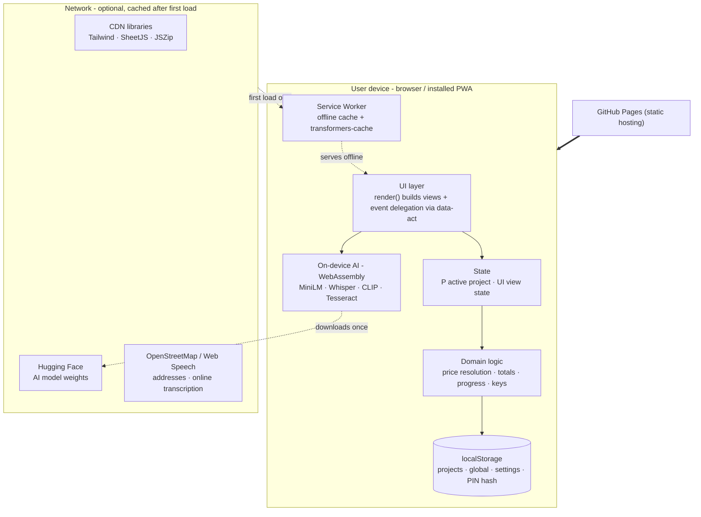
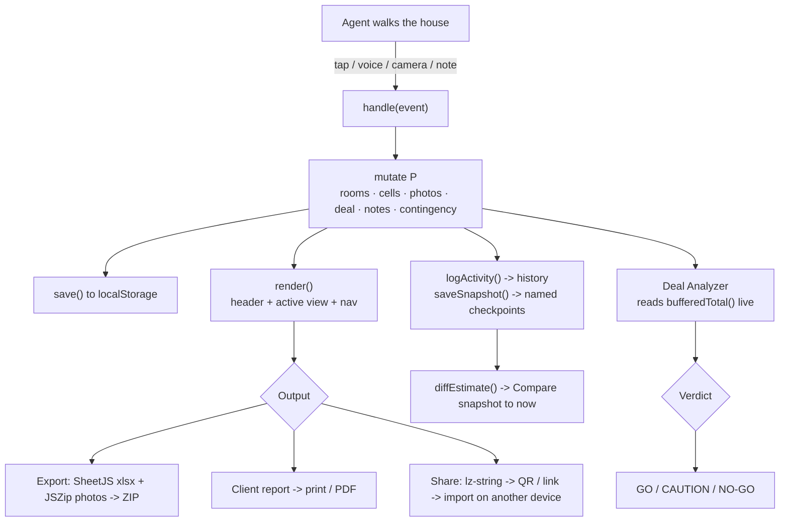

# Architecture

Technical reference for the Spark Homes Repair Estimator. For the product pitch
and feature list, see [README.md](README.md).

---

## 1. Design philosophy

The app is a **single self-contained HTML file** that runs as an offline-first
Progressive Web App. There is deliberately **no build step, no framework, no
bundler, and no server**. Every capability, including the AI, runs on the
device. This is a constraint from the brief (must work with no signal) turned
into the core architectural decision.

Three principles drive the design:

1. **Offline is the default, not a fallback.** The app must fully function in a
   dead-zone basement. Anything that needs the network is treated as a
   best-effort enhancement that degrades gracefully.
2. **On-device intelligence.** Voice, chat, and vision AI run locally via
   WebAssembly models, so "AI" never becomes an online dependency.
3. **One render path.** A single `render()` function rebuilds the screen from
   state. No virtual DOM, no reactivity library. State in, HTML out.

### System diagram



Everything inside the device box works with no network. The network box is
optional and only touched on first load (or for live online transcription and
address lookup), after which its assets are cached.

---

## 2. Is there a "backend"?

No traditional backend. There is no server, database, API, or auth service.
What would normally live server-side is replaced by three on-device layers:

| Traditional backend concern | How this app handles it |
|---|---|
| Database | `localStorage` (structured JSON) |
| File/asset serving | GitHub Pages (static) + service-worker cache |
| Business logic / API | Pure JavaScript functions in `index.html` |
| AI / ML inference | On-device WASM models (Transformers.js) |
| Auth | Client-side PIN lock (SHA-256 hash on device) |
| Hosting | GitHub Pages static hosting |

The only outbound network calls are: loading CDN libraries and AI models once
(then cached forever), optional address lookup (OpenStreetMap), and optional
browser speech recognition. None are required for the core workflow.

---

## 3. File layout

```
index.html        the entire application (UI, state, logic, AI, styles)
sw.js             service worker (offline caching strategy)
manifest.json     PWA manifest (installable, standalone, themed)
spark-logo.png    brand logo
icon-*.png        PWA / home-screen icons
favicon.png       favicon
apple-touch-icon.png
README.md         product overview
ARCHITECTURE.md   this document
Pricing List.csv  source pricing (embedded into index.html, git-ignored)
```

Confidential contest materials (brief, reference app, raw price list) are
git-ignored and not published.

---

## 4. Runtime / PWA layer (`sw.js`)

A service worker provides the offline shell and asset persistence, keyed on a
bumpable cache version (`spark-estimator-vNN`).

- **App shell** (html, manifest, icons, logo) is pre-cached on `install`.
- **Document / navigations** use a **network-first** strategy, so updates appear
  when online and fall back to cache when offline.
- **Static assets and CDN libraries** use **cache-first**, populated on first
  miss. Runtime-cached hosts include the CDN libraries plus the Hugging Face
  model hosts and the Tesseract trained-data host, so the AI models persist for
  offline use.
- On `activate`, old cache versions are deleted and clients are claimed. A
  `skipWaiting` message allows immediate updates.

Separately, **Transformers.js manages its own `transformers-cache` Cache Storage**
for model weights. This is why the AI pack downloads once and never re-downloads:
the ~90 MB of model files live permanently in browser Cache Storage and load
back into memory in about a second.

`manifest.json` makes the app installable and standalone, with a portrait
orientation and the brand theme color.

---

## 5. Frontend architecture

Everything below lives inside the single `<script>` in `index.html`, organized
as a layered stack.

### 5.1 Layer 1: static data (constants)

- `PRICE_LIST` - the ~108 line items from the pricing CSV, embedded verbatim as
  `{ id, name, cost, unit }` so no fetch is needed.
- `GROUPS` - maps a group id to `{ label, ids[] }`, organizing items into
  collapsible groups (Flooring, HVAC, Cabinets, Tub & Shower, etc.).
- `ROOM_TYPES` - the 7 room types, each with `{ label, section, icon, single,
  groups[] }`. House-wide singletons (Interior, Systems, Exterior) and
  repeatable rooms (Kitchen, Bathroom, Bedroom, Living).
- `KB` - the repair-guidelines knowledge base used by the Copilot assistant.
- `VISION_LABELS`, `SYNONYMS`, `STOP`, `ROOM_KEYWORDS` - lookup tables for the
  AI layer.

### 5.2 Layer 2: persistence (`localStorage`)

All data is JSON in `localStorage`. Keys:

| Key | Contents |
|---|---|
| `spark_projects_v1` | Array of all estimates (the bulk of the data, including photos as base64) |
| `spark_current_v1` | Id of the last-open estimate |
| `spark_global_v1` | Standard-price overrides, custom items, deleted items (shared across estimates) |
| `spark_agent_v1` | Agent name (stamped on reports/exports) |
| `spark_lock_v1` | PIN + recovery code, stored only as SHA-256 hashes |
| `spark_ai_installed_v1` | Which AI models have been downloaded |
| `spark_dark`, `spark_onboarded`, `spark_voicehint` | UI flags |

Helpers `j()` (safe parse) and `setLS()` (safe stringify, returns false on quota
failure) wrap all reads/writes. `save()` persists the active project; `saveSoon()`
debounces high-frequency writes (like typing in the Deal tab) so the whole
projects array is not serialized on every keystroke.

### 5.3 Layer 3: domain logic (pure functions)

- **Price resolution**: `priceOf(id)` resolves per-project override, then global
  override, then the list default. `catalog()` is `PRICE_LIST + custom - deleted`.
- **Totals**: `lineTotal`, `groupTotal`, `roomTotal`, `grandTotal`. `grandTotal()`
  is always the raw sum of selected line items; `bufferedTotal()` layers the
  contingency cushion on top (`grandTotal * (1 + contingency/100)`). The Deal
  Analyzer, report, Excel, and header planning total all read `bufferedTotal()`,
  while the scope-of-work line items still sum to `grandTotal()`.
- **Progress / completion**: `progress()`, `groupComplete`, `isChecked`.
- **Composite keys**: the estimate is a **flat map**, not a nested tree. Cells are
  keyed `"roomId|groupId|itemId"` and "No Action Needed" flags `"roomId|groupId"`.
  Deleting a room or group is a prefix sweep over `Object.keys`.

### 5.4 Layer 4: state and the render loop

- `P` - the active project object (persisted). Beyond scope (`rooms`, `cells`,
  `nan`, `priceOverrides`, `photos`, `deal`), it carries `contingency` (buffer
  %), `notes[]` (inspection notes), `history[]` (activity log), and
  `snapshots[]` (named checkpoints).
- `UI` - ephemeral view state: current tab, current room, open groups, busy flag.

`render()` is the heart of the app:

1. If no active project, render the home dashboard (or lock / welcome screens).
2. Otherwise build the whole screen as one template string:
   `header + <main>{active tab view}</main> + bottom nav`.
3. `$app.innerHTML = ...` replaces everything.
4. `bind()` re-attaches listeners via **event delegation**: every interactive
   element carries a `data-act` attribute, and `bind()` wires the right event
   (`click` / `input` / `change`) to a single `handle()` dispatcher. Modals are a
   second surface: `bindModal()` wires their `data-m` buttons to `handleModal()`,
   and also routes any `data-act` buttons inside a modal back to `handle()` so
   shared actions (snapshot compare / restore / delete, clear history) work from
   inside a sheet.

State mutation always follows the same cycle: **handler -> mutate `P` -> save()
-> render()**. A few hot paths do targeted partial re-renders to preserve scroll
position and input focus: room switching, deal inputs, and the contingency
slider / number box (which update the readouts live on `input` and only commit a
full `render()` on `change`, so dragging is never interrupted).

### 5.5 Layer 5: views

Five tabs, each a function returning an HTML string:

- **Estimate** (`viewEstimate` / `roomChipsHTML` / `roomBodyHTML`): room strip +
  collapsible group accordions with checkboxes, quantity steppers, price
  overrides, custom items, a progress bar, the House X-Ray cost map, and the
  inspection-notes card.
- **Photos** (`viewPhotos`): camera/upload + live capture, thumbnails, captions,
  serial OCR.
- **Copilot** (`viewCopilot`): the AI layer (see section 6).
- **Deal** (`viewDeal`): the Deal Analyzer with a contingency control (slider +
  typed % + presets), a profit waterfall, and an ROI gauge.
- **Export** (`viewExport`): summary, donut and treemap charts, and export /
  share / report actions.

Modals and full-screen overlays (voice walkthrough, live camera, client report,
lock, welcome) are separate render paths.

---

## 6. The AI layer (100% on-device)

All AI runs locally via **Transformers.js** (Xenova) with WebAssembly. Three
models, each lazy-loaded on first use and cached permanently:

| Model | Purpose | Task |
|---|---|---|
| `all-MiniLM-L6-v2` | Copilot semantic search + voice matching | feature-extraction (embeddings) |
| `whisper-tiny.en` | Offline speech-to-text | automatic-speech-recognition |
| `clip-vit-base-patch32` | Camera scope detection | zero-shot-image-classification |
| `Tesseract.js` | Serial-plate OCR | (separate lib, lazy-loaded) |

A one-tap **"Offline AI pack"** in the Copilot tab downloads all three while
online, with per-model readiness status persisted so it never nags again.

### 6.1 Copilot assistant

A layered resolver, not a chat LLM:

1. **`computedAnswer(q)`** - instant rule/regex intents over live state:
   greetings and small talk, running total, item counts per room/house, biggest
   cost, per-room cost, most/least expensive room, room count, "what's missing"
   (coverage), and the full deal/profit math.
2. **Semantic KB retrieval** - if a computed intent does not match, embed the
   question and cosine-match against the embedded knowledge base; answer only
   above a similarity threshold.
3. **Keyword fallback** - whole-word overlap when the model is not loaded.
4. **Honest fallback** - "I don't know" with example questions, rather than a
   wrong canned answer.

Three rule-based **specialist agents** also read the estimate: Inspection
Coverage (flags unreviewed groups, guards big-ticket systems), Recommendations
(commonly-paired work triggered only by items already selected, each stating its
trigger), and Anomaly & Risk (outlier quantities, extreme price overrides,
conflicting scope).

### 6.2 Voice walkthrough

Dual-engine, so it works online and offline:

- **Online**: the browser Web Speech API (fast, but cloud-based).
- **Offline / fallback**: on-device Whisper. Record audio, decode to 16 kHz mono
  via `AudioContext`, transcribe locally.

Either transcript flows into `processSpeech()`, which splits the utterance into
phrases, detects room context, extracts a quantity per phrase, and matches items
via a synonym-aware keyword extractor with a semantic fallback. Multiple items
per breath are supported ("kitchen, cabinets and five doors" adds all three with
the right counts). A text box provides an always-works path on any device.

### 6.3 Camera scope detection

CLIP zero-shot classification scores the current camera frame against labels
mapped to line items, plus "good condition / irrelevant" decoy labels. If the
top match is a decoy, it suggests nothing; otherwise it surfaces one-tap adds.

---

## 7. Feature subsystems

- **Deal Analyzer**: pulls the live **buffered** repair total (raw +
  contingency), computes profit, ROI, holding and selling costs, a
  GO/CAUTION/NO-GO verdict, and the 70%-rule max offer. Rendered with an SVG
  profit waterfall and an SVG speedometer gauge.
- **Estimate history & snapshots**: `logActivity()` appends every meaningful
  mutation to `P.history` (capped, grouped by day in the timeline).
  `saveSnapshot()` deep-copies the estimate state (cells, nan, rooms, prices,
  deal, contingency, notes) into `P.snapshots`; `restoreSnapshot()` reverts to
  one after auto-saving the current state first. `diffEstimate()` compares two
  states and returns added / removed / changed items (with per-line dollar
  deltas), room changes, and deal-input changes, rendered by `modalSnapDiff()`.
- **Contingency buffer**: `P.contingency` (a percentage, 0-30) feeds
  `bufferedTotal()`. Set from the Deal-tab card or a header-tap modal, both a
  slider **and** a typed number box (any value, not just presets), kept in sync.
  It flows into the Deal math, client report, Excel deal sheet, email hand-off,
  copilot deal answer, property comparison, and shared links.
- **Inspection notes**: `P.notes` holds `{ id, ts, room, text }` entries added
  from the Estimate tab (auto-tagged to the current room), rendered on the
  client report, exported as their own Excel sheet, and included in the email
  hand-off and shared links.
- **Data viz**: cost-by-section donut (SVG stroke arcs) and cost-by-room
  squarified treemap, both generated inline with no chart library.
- **Photos**: images compressed to <=1280px JPEG before base64 storage;
  on-device serial OCR via Tesseract; live-capture frame grabbing.
- **Export**: SheetJS builds an .xlsx (Estimate + Deal Analysis sheets), JSZip
  bundles it with all photos into one auto-downloaded ZIP.
- **Client report**: a print-ready, branded HTML report rendered in an in-app
  iframe (forced light theme), with a Done bar and Print/Save-as-PDF.
- **Backendless handoff**: an estimate (minus photos) is compressed with
  lz-string into the URL hash; a QR code (qrcode-generator) or copied link
  imports it on any device, no server.
- **Real addresses**: debounced OpenStreetMap (Photon) suggestions while typing,
  plus GPS + reverse geocode; offline it keeps raw coordinates.
- **PIN lock**: optional app lock; the PIN and a one-time recovery code are
  stored only as SHA-256 hashes. Forgot-PIN uses the recovery code (which then
  clears the PIN); last resort is an explicit full data wipe.

---

## 8. Responsive design

Mobile-first, then a responsive frame for tablets/desktop:

- The app container is `max-w-md` on phones, widening to `max-w-3xl` on iPad
  portrait and `max-w-5xl` on landscape/desktop. The bottom nav, overlays, and
  modal sheet widen in lockstep so nothing misaligns.
- Content uses the extra width: home estimate cards and estimate group cards
  switch to two columns at the `md` breakpoint (groups use CSS multi-column with
  break-inside-avoid so accordions do not split).

Styling is Tailwind utility classes, **precompiled with the Tailwind CLI and
inlined** into `index.html` (no runtime CDN), plus a small custom `<style>` block
for animations, the dark theme overrides, the iOS-style theme switch, the header
history pill, and the responsive overlay rules. Inlining the compiled CSS means
styles exist before first paint, so there is no flash of unstyled content on a
cold open. Dark mode toggles a `.dark` class on `<html>`; a `.theme-anim` class
enables a smooth color transition only during the flip.

---

## 9. External libraries (all CDN, all cached)

| Library | Role | Loaded |
|---|---|---|
| Tailwind CSS | Utility styling | precompiled + inlined (no runtime dependency) |
| SheetJS (xlsx) | Excel generation | on page load |
| JSZip | Bundle xlsx + photos | on page load |
| Transformers.js (Xenova) | On-device embeddings / Whisper / CLIP | lazy |
| Tesseract.js | Serial OCR | lazy |
| lz-string | Compress estimate into a share link | lazy |
| qrcode-generator | Render the share QR | lazy |

None are required to boot; each enhances a specific feature and is cached for
offline use after first load.

---

## 10. Data flow (one estimate, end to end)



Nothing leaves the device unless the agent explicitly exports or shares.

---

## 11. Build and deploy

There is no build. Development is any static file server
(`python3 -m http.server 4173`). Deployment is GitHub Pages serving the static
files directly. Updates ship by bumping the service-worker cache version so
installed clients refresh on next launch.
